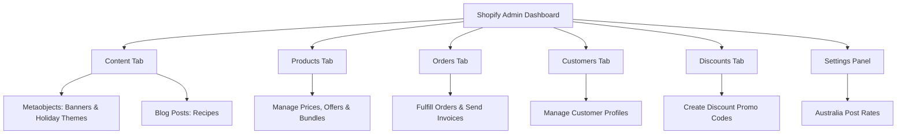

# 🌶️ Masaliya Di Hatti — Headless Storefront Administration SOP
### Complete Standard Operating Procedure (SOP) Manual for Store Management

Welcome to your complete storefront administration manual! Your storefront is built using a **Headless Shopify Architecture**. This means your visual design is premium, secure, and lightning-fast on Next.js/Vercel, while all of your store content, orders, products, recipes, holidays, and customers are managed dynamically through your unified **Shopify Admin Dashboard** (`admin.shopify.com`).

---

## 🗺️ Quick Directory Navigation

---

## 🖼️ SOP 1: Banner Image & Content Management

Your homepage features an elegant, animated hero slider. All slide images, titles, and taglines are managed dynamically via Shopify Metaobjects.

### Steps to Edit or Add Slide Banners:
1. Log in to your **Shopify Admin Panel** (`admin.shopify.com`).
2. On the left sidebar menu, click **Content**, then select **Metaobjects**.
3. Select the definition named **`new image`** (type handle: `new_image`) from the list.
4. **To add a new slide:** Click the **Add entry** button in the top right.
5. **To edit an existing slide:** Click on the row of the slide you wish to modify.
6. Configure the following fields:
   * **Banner Imag:** Click **Select image** to choose an image from your files, or upload a new one. (High-resolution landscape/banner aspect ratio recommended).
   * **new:** Enter the brand name, headline, or slide title (e.g., `Roopak Spices`, `Shan e Delhi`, `Star Premium Collections`). This appears as the large text overlay on the banner.
7. Under the **Status** section at the bottom, ensure it is set to **Active**.
8. Click **Save** in the top right corner.

---

## 🎨 SOP 2: Storefront Holiday Theme Switcher

You can dynamically change the entire color scheme of your website from your Shopify Admin panel during festivals and holidays without editing any code.

### Steps to Create/Change the Color Theme:
1. Navigate to **Content** -> **Metaobjects** in your Shopify Admin.
2. Select **`Storefront Theme`** (type handle: `storefront_theme`).
3. Click on the active theme entry in the list (or click **Add entry** if creating a new one).
4. Configure your theme settings:
   * **Active Theme:** Set this value exactly to one of the following presets:
     * `default` (Normal teal theme)
     * `christmas` (Classic deep red theme)
     * `diwali` (Warm marigold & gold theme)
     * `eid` (Forest green theme)
     * `custom` (Tells the storefront to read custom colors below)
   * **Primary Color:** If using the `custom` preset, enter your desired primary Hex color code (e.g., `#3b5998` for navy).
   * **Accent Color:** If using the `custom` preset, enter your desired button/link accent Hex color code (e.g., `#f7931e` for orange).
   * **Festival Name:** Enter the display name for the festive event (e.g., `Diwali Special Sale`).
5. Click **Save**. The website colors (navbars, footers, buttons, and visual overlays) will switch instantly upon refresh!

---

## 📦 SOP 3: Product Cataloging & Inventory Setup

Your `/shop` catalog and individual product detail pages are automatically in sync with your live Shopify inventory.

### Steps to Add or Edit a Standard Product:
1. Click **Products** in your Shopify left sidebar.
2. Click **Add product** (or select a product from the list to edit).
3. Enter the **Title** (e.g., `Premium Turmeric Powder`) and a **Description**.
4. In the **Media** box, upload high-quality product images.
5. **Sales Channel Publishing (Critical):**
   * On the right-side panel under **Publishing**, click the **Manage** button (or click the active channel text).
   * Ensure that **`Masaliya Di Hatti (Luxury Of Spices) Headless`** is checked/enabled. (If unchecked, the storefront API cannot fetch the product).
   * Click **Done**.
6. **Category / Tab Mapping:**
   * Under the **Product organization** card, find the **Product type** field.
   * Enter one of the following category names exactly: **`Best Sellers`**, **`New Arrivals`**, or **`Combo Packs`**.
   * If left blank or set to something else, the product will *only* show up under the **"All Products"** tab on your storefront.
7. Click **Save**.

---

## 🎁 SOP 4: Creating Curated Spice Bundles

Shopify does not have a separate "bundle" section by default, so you create bundles as standard **Products** in your Shopify Admin:

### Steps to Create a Bundle:
1. Click **Products** -> **Add product**.
2. Set the product title **exactly** as it appears on the website, followed by the word **Bundle**:
   * `Starter Essentials Bundle`
   * `Biryani Master Kit Bundle`
   * `Non-Veg Lovers Bundle`
   * `Premium Gift Box Bundle`
   * `Vegetarian Delight Bundle`
   * `Street Food Special Bundle`
3. Set the price to match the bundle price (e.g., `24.99` for Starter Essentials).
4. Under **Publishing** on the right side, make sure it is checked/published to the **`Masaliya Di Hatti (Luxury Of Spices) Headless`** sales channel.
5. Add inventory stock count and click **Save**.

---

## 🏷️ SOP 5: Setting Up Offers, Sales & Discounts

You can show sale offers on products by setting a discounted price alongside a crossed-out original price, or create coupon codes.

### Steps to Set a Sale Price (Compare-At Price):
1. Open the product details page in your Shopify Admin.
2. **If the product has variants (multiple sizes/weights):**
   * Scroll down to the **Variants** section.
   * Click on the name of the variant (e.g., `100 grams`) to open its specific settings.
3. **If the product has NO variants (simple product):**
   * Scroll directly to the **Pricing** section on the main page.
4. Set the pricing parameters:
   * **Price:** Enter the active discounted sale price (what the customer will pay, e.g., `20.00`).
   * **Compare-at price:** Enter the original, higher price (which will show up crossed out in black, e.g., `25.00`).
5. Click **Save** in the top right.

### Steps to Create a Coupon Code (Discount Code):
1. Click **Discounts** in your Shopify left sidebar.
2. Click **Create discount** in the top right.
3. Choose **Amount off products** (or Order, Free Shipping, Buy X get Y).
4. Select **Discount code** and type the code name (e.g. `WELCOME10`).
5. Under **Value**, select **Percentage** (e.g., `10%`) or **Fixed amount** (e.g., `$10.00`).
6. Under **Minimum purchase requirements**, set any limits if needed.
7. Click **Save**. Customers can now apply this code at checkout to get a discount.

---

## 🍲 SOP 6: Recipe & Blog Post Management

Every single recipe on the `/recipes` page is managed natively via Shopify Blog Posts.

### Steps to Add or Edit Recipes:
1. Navigate to **Content** -> **Blog posts** in your Shopify left sidebar.
2. Click **Create blog post** (or choose an existing recipe from your list).
3. Set the **Title** (e.g., `Butter Chicken` or `Dum Biryani`).
4. Type your cooking instructions and descriptions inside the **Content** text editor.
5. In the **Featured image** card (right-side column), upload your recipe image.
6. Under **Organization**, click the **Blog** dropdown, select **Recipes**, and make sure it is selected.
7. Under the **Visibility** panel, switch the status to **Visible**.
8. **Meta-Data Tagging System:**
   * To format the recipe card's duration, serves, difficulty, and matched spices, copy and paste the following custom tags directly into the **Tags** box in Shopify:

| Tag Format | Example | Purpose on Storefront |
| :--- | :--- | :--- |
| `time:[Duration]` | `time:45 min` | Shows the preparation/cooking time. |
| `serves:[Number]` | `serves:4` | Shows the recommended serving size. |
| `difficulty:[Level]` | `difficulty:Easy` | Shows difficulty badge (`Easy`, `Intermediate`, `Advanced`). |
| `category:[Tab Slug]` | `category:north-indian` | Places the recipe in the correct tab: `quick`, `north-indian`, `biryani`, `grills`, `street`, or `south-indian`. |
| `spices:[Comma-separated list]` | `spices:Punjabi Chole Masala, Shahi Garam Masala` | Displays clickable links to the exact spice products used in the recipe. |

9. Click **Save**.

---

## 💳 SOP 7: Order Management & Fulfillments

All financial checkouts automatically sync to your Shopify dashboard when customers complete their purchase.

### Checking and Fulfilling Your Orders:
1. Click **Orders** in your Shopify left sidebar.
2. Every successful checkout instantly populates here as an active order showing:
   * The products bought and quantities.
   * Customer shipping address and email.
   * Selected shipping service (e.g., *Australia Post Express*).
   * Complete payment authorization.
3. Once you package the spices and drop them off at the post office:
   * Click **Fulfill items** inside the order details page.
   * Enter the tracking number from Australia Post.
   * Click **Fulfill items** again. This automatically sends a tracking link email to the customer!

---

## 📦 SOP 8: Direct Bank Transfer & QR Code Email Invoices

You can customize your Shopify email notifications to include bank transfer details and a scannable QR Code.

### Steps to Upload your Payment QR Code:
1. In Shopify Admin, click **Content** -> **Files** (in the left menu).
2. Click **Upload files** and select your Payment QR Code image.
3. Once uploaded, click the **link icon** next to the file to copy its direct URL (it will look like `https://cdn.shopify.com/s/files/.../your_qr_code.png`).

### Steps to Add Bank Details and QR Code to Email Invoices:
1. Go to **Settings** -> **Notifications** -> **Customer notifications**.
2. Select **Draft order invoice** (the invoice sent when you create an order manually).
3. Click **Edit code** in the top right.
4. Scroll down to the bottom of the HTML template code (near the `</footer>` tag or right before the closing `</body>` tag).
5. Paste a custom HTML block containing your bank details and the copied QR code image URL (you can copy this template from the local `shopify_management_guide.md` file).
6. Click **Save** in the top right.

---

## 👥 SOP 9: Manual Wholesale Invoices & Custom Orders

When a wholesale customer calls or contacts you, you can manually construct an invoice with special wholesale prices and email it to them.

### Steps to Create a Manual Wholesale Order:
1. Go to **Orders** -> **Drafts** in your Shopify left sidebar.
2. Click the **Create order** button in the top right.
3. **Add Products:** Search for and select the items the customer wants to order.
4. **Override Item Prices:** To set a custom price on a product:
   * Click on the price of the item in the list.
   * Enter the negotiated wholesale price.
   * Click **Done**.
5. **Add Shipping:** Click **Add shipping** and select **Custom** to enter a manual flat shipping cost (or select from your standard rates).
6. **Add Customer Profile:**
   * On the right-side panel under **Customer**, click **Create new customer** or search for an existing profile.
   * Make sure you enter their **Email address** and **Shipping Address**.
7. **Email the Invoice:**
   * Click the **Send invoice** button in the top right.
   * Review the email template and click **Send invoice**.
   * The customer will receive an email with a **"Complete your purchase"** button that takes them directly to your secure checkout page to pay online.

---

## 👥 SOP 10: Creating & Managing Customer Profiles

All customer accounts registered on your website or created manually are managed safely inside Shopify's CRM database.

### Steps to Create a New Customer Profile Manually:
1. Log in to your **Shopify Admin** (`admin.shopify.com`).
2. Click **Customers** in your Shopify left sidebar.
3. Click the **Add customer** button in the top right corner.
4. Fill out the customer's details:
   * **First Name & Last Name** (e.g., `Abhi Saxena`)
   * **Email Address** (Critical: this is where they will receive invoices and order confirmations)
   * **Phone Number**
5. Under the **Addresses** section:
   * Click **Add address**.
   * Enter the customer's **Shipping Address** (Street, City, State, Postcode, and Country).
   * Click **Done**.
6. (Optional) Check the **"Customer agreed to receive marketing emails"** box if they wish to receive updates.
7. Click **Save** in the top right corner. The customer profile is now active and can be linked to manual orders!

---

## 🚚 SOP 11: Shipping Configuration (Australia Post Weight & Rates)

Your storefront uses an automated Australia Post PAC API calculator. For this to work correctly, every product variant must have its weight configured in Shopify.

### Steps to Configure Product Weight for Shipping:
1. Open the product page in Shopify Admin.
2. Scroll to the **Variants** section and click on the variant row (e.g. `100 grams`).
3. Scroll to the **Shipping** section:
   * Select **Physical product**.
   * **Weight:** Enter the exact package weight in kilograms (e.g., `0.1` kg for a 100g variant).
4. Click **Save**.

### Steps to Update Store Origin Postcode:
1. Go to **Settings -> Shipping and delivery** in Shopify.
2. Under **Shipping origins**, ensure your store address and postcode (e.g., `3000` for Melbourne) are set correctly. The calculator uses this postcode as the starting point for shipping rate calculations.
